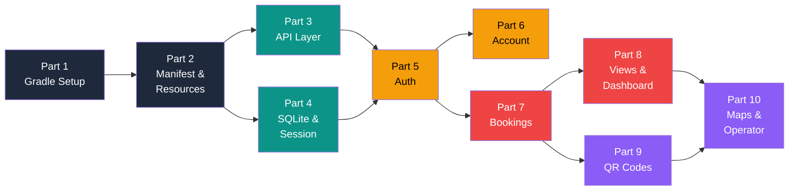

# Smart Solar Microgrid — Android App: 10-Part Build Plan

> Each part is self-contained and builds on the previous one. Complete them in order.

---

## Part 1 — Project Scaffolding & Gradle Configuration

> Set up the Android Studio project skeleton, Gradle build files, wrapper, and `.gitignore`.

| # | File | Purpose |
|---|------|---------|
| 1 | `android/SmartSolarApp/settings.gradle.kts` | Project name + plugin management |
| 2 | `android/SmartSolarApp/build.gradle.kts` | Project-level Gradle config |
| 3 | `android/SmartSolarApp/gradle.properties` | JVM args, AndroidX opt-in |
| 4 | `android/SmartSolarApp/gradle/wrapper/gradle-wrapper.properties` | Gradle 8.x wrapper config |
| 5 | `android/SmartSolarApp/gradlew.bat` | Windows build script |
| 6 | `android/SmartSolarApp/.gitignore` | Ignore build/, .gradle/, local.properties |
| 7 | `android/SmartSolarApp/app/build.gradle.kts` | App-level config — SDK versions, all dependencies (Retrofit, OkHttp, ZXing, Maps, Material) |
| 8 | `android/SmartSolarApp/app/proguard-rules.pro` | ProGuard rules |

**After this part:** The project syncs in Android Studio without errors.

---

## Part 2 — Android Manifest, Resources & Theming

> Create the manifest (all activities + permissions), theme/colors/strings, drawables, dimensions, and bottom navigation menus.

| # | File | Purpose |
|---|------|---------|
| 1 | `app/src/main/AndroidManifest.xml` | All activities registered, permissions (INTERNET, LOCATION, CAMERA) |
| 2 | `app/src/main/res/values/colors.xml` | Solar-themed color palette |
| 3 | `app/src/main/res/values/themes.xml` | Light Material3 theme |
| 4 | `app/src/main/res/values-night/themes.xml` | Dark theme variant |
| 5 | `app/src/main/res/values/strings.xml` | All user-facing strings |
| 6 | `app/src/main/res/values/dimens.xml` | Margins, padding, text sizes |
| 7 | `app/src/main/res/drawable/btn_primary.xml` | Primary button shape |
| 8 | `app/src/main/res/drawable/btn_secondary.xml` | Secondary button shape |
| 9 | `app/src/main/res/drawable/btn_danger.xml` | Danger/cancel button shape |
| 10 | `app/src/main/res/drawable/card_background.xml` | Card shape with shadow |
| 11 | `app/src/main/res/drawable/gradient_header.xml` | Header gradient background |
| 12 | `app/src/main/res/drawable/edit_text_background.xml` | Input field style |
| 13 | `app/src/main/res/menu/bottom_nav_prosumer.xml` | Bottom nav — Dashboard, Bookings, Map, Profile |
| 14 | `app/src/main/res/menu/bottom_nav_operator.xml` | Bottom nav — Home, Scan QR, Map |

**After this part:** App compiles and launches with correct theme, but no activities yet.

---

## Part 3 — Utilities, Constants & API Layer

> Build the core infrastructure: constants, validation helpers, date-time utilities, Retrofit API client, all endpoint definitions, and DTO model classes.

| # | File | Purpose |
|---|------|---------|
| 1 | `utils/Constants.java` | API base URL, shared pref keys, date formats |
| 2 | `utils/NetworkUtils.java` | Check internet connectivity |
| 3 | `utils/DateTimeUtils.java` | 7-day window check, 12-hour notice check |
| 4 | `utils/ValidationUtils.java` | NIC format validation, email, phone, required fields |
| 5 | `api/ApiClient.java` | Retrofit + OkHttp singleton with auth interceptor |
| 6 | `api/ApiService.java` | All REST endpoint definitions (@GET, @POST, @PUT, @DELETE) |
| 7 | `api/ApiCallback.java` | Generic success/error callback interface |
| 8 | `api/models/LoginRequest.java` | Login DTO |
| 9 | `api/models/LoginResponse.java` | Token + role + profile DTO |
| 10 | `api/models/RegisterRequest.java` | Registration DTO |
| 11 | `api/models/ProsumerProfile.java` | Full prosumer profile DTO |
| 12 | `api/models/BookingRequest.java` | Create/update booking DTO |
| 13 | `api/models/BookingResponse.java` | Booking details from server |
| 14 | `api/models/BookingSummary.java` | Summary after booking action |
| 15 | `api/models/MicrogridNode.java` | Grid node with GPS, capacity |
| 16 | `api/models/DashboardStats.java` | Pending count + approved count |
| 17 | `api/models/ApiError.java` | Error response wrapper |

**After this part:** Full API layer ready — any activity can make REST calls.

---

## Part 4 — SQLite Database & Session Management

> Create the local SQLite database (3 tables), DAO classes for CRUD, session manager for login state, and the Application class.

| # | File | Purpose |
|---|------|---------|
| 1 | `SmartSolarApplication.java` | Application class — init singletons |
| 2 | `db/DatabaseHelper.java` | SQLiteOpenHelper — creates `user_session`, `booking_cache`, `node_cache` tables |
| 3 | `db/UserDao.java` | Insert/get/delete local user session |
| 4 | `db/BookingCacheDao.java` | Insert/query/clear cached bookings |
| 5 | `db/NodeCacheDao.java` | Insert/query/clear cached grid nodes |
| 6 | `auth/SessionManager.java` | SharedPreferences — store/retrieve auth token, role, NIC, login state |

**After this part:** Local persistence fully operational — login state survives app restart.

---

## Part 5 — Authentication Module (Login + Register)

> Build login and registration screens. Login routes to role-specific home. Register uses NIC as primary key.

| # | File | Purpose |
|---|------|---------|
| 1 | `res/layout/activity_login.xml` | Login form — NIC/email + password + buttons |
| 2 | `res/layout/activity_register.xml` | Registration form — NIC, name, email, phone, address, password |
| 3 | `auth/LoginActivity.java` | API login → save session → route by role (Prosumer→Dashboard, Operator→OperatorHome) |
| 4 | `auth/RegisterActivity.java` | Validate inputs → API register → show success → go to login |

**After this part:** Users can register and log in. Role-based routing works.

**Marks covered:** Login with role-based home (2) + Create account (3) = **5 of 9 marks**

---

## Part 6 — Account Management (Profile, Edit, Deactivate)

> Prosumer views profile, edits details, and requests account deactivation.

| # | File | Purpose |
|---|------|---------|
| 1 | `res/layout/activity_profile.xml` | Profile display — NIC, name, email, phone, status |
| 2 | `res/layout/activity_edit_profile.xml` | Editable form pre-filled with current data |
| 3 | `res/layout/activity_deactivate.xml` | Confirmation screen with reason field |
| 4 | `account/ProfileActivity.java` | Fetch profile from API, display, option to edit/deactivate |
| 5 | `account/EditProfileActivity.java` | Load current data → edit → PUT to API → show result |
| 6 | `account/DeactivateAccountActivity.java` | Confirm → POST deactivation request → logout |

**After this part:** Full prosumer account lifecycle works.

**Marks covered:** Modify own account (1) + Deactivate account (1) = **2 marks → Total 7 of 9**

---

## Part 7 — Booking/Reservation Workflow

> Create, update, and cancel energy slot reservations. Summary page shown after each action. Business rules enforced by API (7-day window, 12-hour notice).

| # | File | Purpose |
|---|------|---------|
| 1 | `res/layout/activity_create_booking.xml` | Select node, pick date/time slot, confirm |
| 2 | `res/layout/activity_update_booking.xml` | Edit existing booking details |
| 3 | `res/layout/activity_cancel_booking.xml` | Cancel confirmation with booking details |
| 4 | `res/layout/activity_booking_summary.xml` | Summary card — status, node, slot, time, confirmation ID |
| 5 | `booking/CreateBookingActivity.java` | Load nodes → select slot → POST booking → show summary |
| 6 | `booking/UpdateBookingActivity.java` | Load booking → modify → PUT update → show summary |
| 7 | `booking/CancelBookingActivity.java` | Load booking → confirm → DELETE → show summary |
| 8 | `booking/BookingSummaryActivity.java` | Display result after any booking action |

**After this part:** Full reservation CRUD with summary pages.

**Marks covered:** Create (3) + Update (2) + Cancel (2) + Summary (2) = **9 of 9 marks**

---

## Part 8 — Booking Views, History, Search & Dashboard

> List current/pending bookings, view history, search/filter, and display dashboard with counts.

| # | File | Purpose |
|---|------|---------|
| 1 | `res/layout/activity_booking_list.xml` | RecyclerView for current/pending bookings |
| 2 | `res/layout/activity_booking_history.xml` | RecyclerView for past bookings |
| 3 | `res/layout/activity_booking_search.xml` | Search bar + filter dropdowns + results list |
| 4 | `res/layout/item_booking.xml` | Single booking row — node, time, status badge |
| 5 | `res/layout/activity_dashboard.xml` | Stats cards + quick actions + bottom nav |
| 6 | `booking/BookingListActivity.java` | GET pending/current bookings from API → display |
| 7 | `booking/BookingHistoryActivity.java` | GET history from API → display |
| 8 | `booking/BookingSearchActivity.java` | Filter by date/status/node → query API → display |
| 9 | `booking/adapters/BookingAdapter.java` | RecyclerView adapter with status color coding |
| 10 | `dashboard/DashboardActivity.java` | Fetch dashboard stats → show counts + navigation |

**After this part:** Prosumer has a complete home experience with all booking views.

**Marks covered:** Current/pending (2) + History (2) + Filter (2) + Pending reservations (2) + Approved count (2) = **10 of 10 marks**

---

## Part 9 — QR Code Generation & Scanning

> Prosumer generates a secure transaction QR after booking approval. Operator scans QR, verifies against server, finalizes the energy transfer.

| # | File | Purpose |
|---|------|---------|
| 1 | `res/layout/activity_qr_generator.xml` | QR display card + booking details |
| 2 | `res/layout/activity_qr_scanner.xml` | Camera viewfinder + result display |
| 3 | `res/layout/activity_verify_transaction.xml` | Scanned data + server verification result + "Mark Done" button |
| 4 | `qr/QrGeneratorActivity.java` | Encode booking ID + NIC + timestamp → generate QR bitmap (ZXing) |
| 5 | `qr/QrScannerActivity.java` | Launch ZXing scanner → decode → pass to verification |
| 6 | `operator/VerifyTransactionActivity.java` | POST scanned data to API → display verification → finalize job |

**After this part:** End-to-end QR workflow — prosumer generates, operator scans and confirms.

**Marks covered:** QR code scanning (2) + Read QR & update job (2) = **4 marks**

---

## Part 10 — Google Maps, Operator Home & README

> Show nearby microgrid nodes on Google Maps with markers. Build operator home screen. Create project README.

| # | File | Purpose |
|---|------|---------|
| 1 | `res/layout/activity_nearby_nodes_map.xml` | Full-screen MapView + search/filter bar |
| 2 | `res/layout/activity_operator_home.xml` | Operator dashboard — scan QR, view pending, map access |
| 3 | `map/NearbyNodesMapActivity.java` | Fetch nodes from API → plot markers with lat/lng → info windows with details |
| 4 | `operator/OperatorHomeActivity.java` | Operator landing — pending count, quick actions, navigation |
| 5 | `README.md` | Setup instructions, API config, build steps, Member 2 contribution, video link placeholder |

**After this part:** App is **feature-complete**.

**Marks covered:** Show nearby stations on map (5) + Operator mode = **5+ marks**

---

## Summary: Marks Coverage by Part

| Part | Focus | Individual Marks |
|------|-------|:---:|
| 1 | Gradle & project setup | — |
| 2 | Manifest, themes, resources | — |
| 3 | API layer & DTOs | — |
| 4 | SQLite & session management | 3 (SQLite persistence) |
| 5 | Login + Register | 5 (Auth) |
| 6 | Profile, Edit, Deactivate | 2 (Account mgmt) |
| 7 | Create/Update/Cancel booking + Summary | 9 (Reservations) |
| 8 | Booking views, history, search, dashboard | 10 (Dashboard) |
| 9 | QR generate + scan + verify | 4 (QR) |
| 10 | Google Maps + Operator home | 5+ (Maps) |
| | **Total individual marks addressed** | **~38 of 47** |

> [!TIP]
> The remaining marks come from **integration quality** (Web app↔API 2, Mobile↔API 2, Maps API 3, QR scanning 2) which are built into Parts 3–10 automatically.

---

## Recommended Build Order

> **Parts 3 & 4 can be built in parallel.** Everything else follows the dependency chain above.
